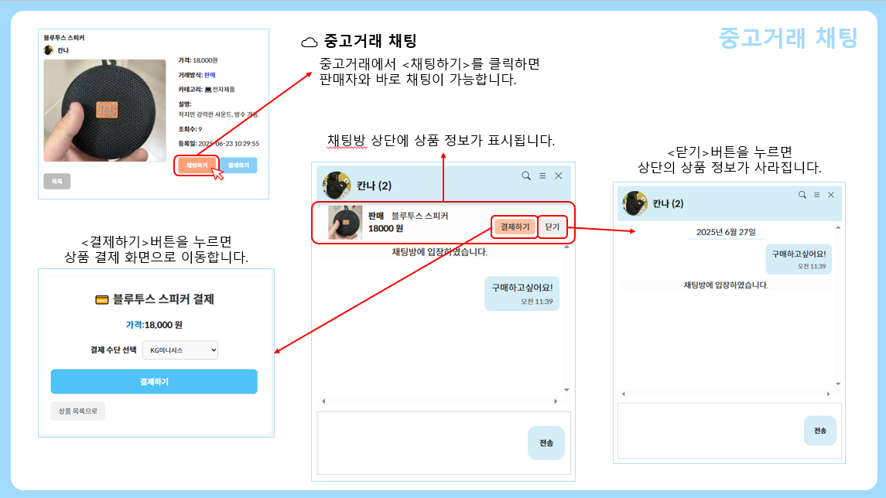
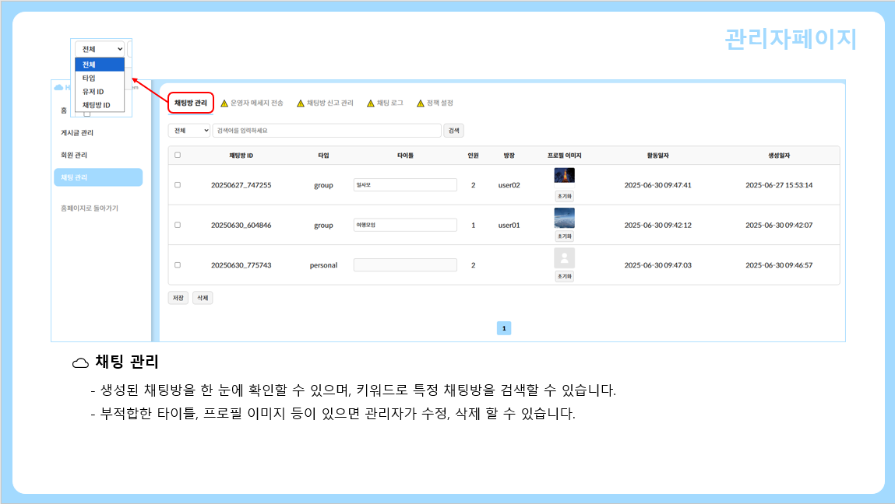
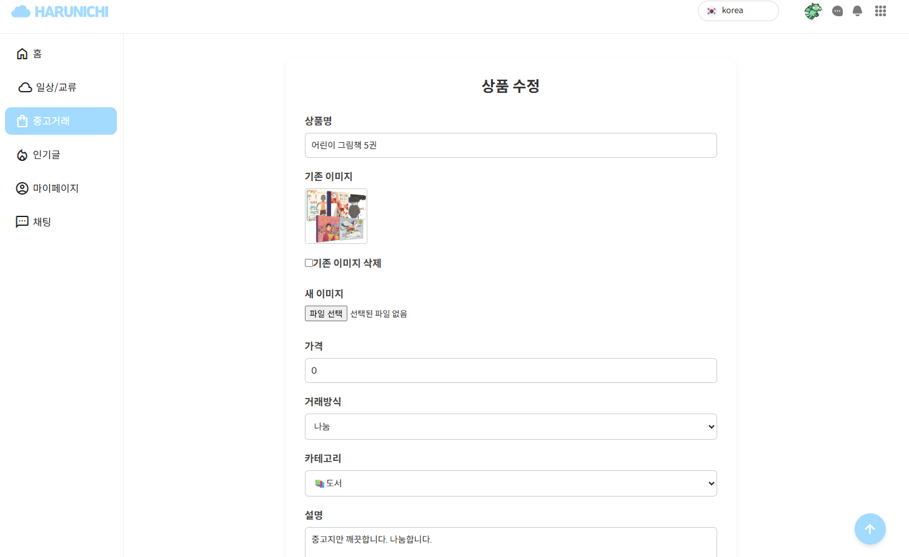
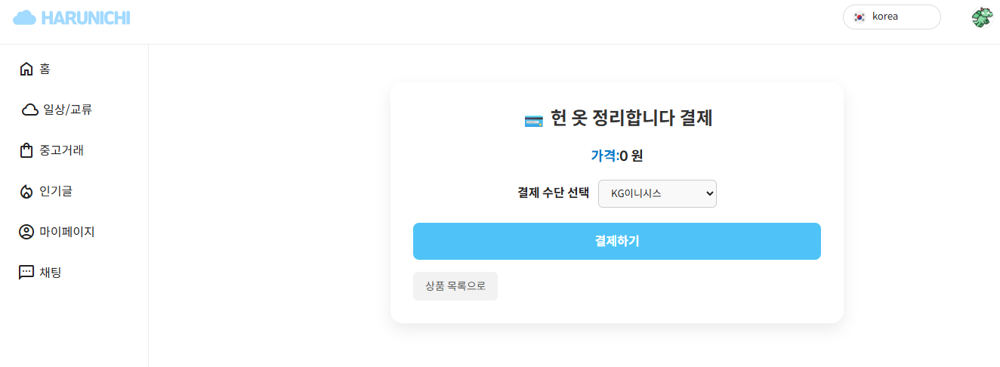
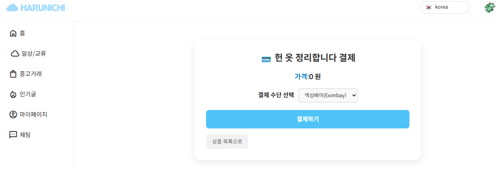

***

# :sparkles: 개요
- **프로젝트명**: Harunichi (한일 소셜미디어 플랫폼)
- **기간**: 2025.05.26 ~ 2025.06.30
- **목표**: 한국과 일본 사용자가 함께 커뮤니케이션하고 중고거래도 가능한 웹 기반 소셜미디어 플랫폼 개발

## :busts_in_silhouette: 팀원
- Member : 강혜미 (<https://github.com/hyeming-way>)
- Member : 이지원 (<https://github.com/jeejeewon>)
- Member : 윤지원 (<https://github.com/YOON-J11>)
- Member : 한현주 (<https://github.com/Nyangmong>)

## 📑 목차
- [개발 환경](#sunny-개발-환경)
- [구현한 기능들](#hatched_chick-구현한-기능들)
- [DB 구성](#shaved_ice-db-구성)
- [마무리 소감](#carousel_horse-마무리-소감)

***

# :sunny: 개발 환경

### 👀 View

### 🎉 DB

### 🔥 Server

### 🌌 개발 도구

### 🌠 개발 언어

### ⭐ 사용 API
- [카카오 로그인 API](https://developers.kakao.com/docs/latest/ko/kakaologin/common)
- [아임포트 포트원 결제 API (KG이니시스, 엑심베이)](https://developers.portone.io/api/rest-v1/pg)

***

# :hatched_chick: 구현한 기능들

## 🏠 메인화면

---

## 👥 회원 기능

로그인

회원가입

회원정보 수정/탈퇴

아이디/비밀번호 찾기

---

## 📝 게시판

공지사항 게시판

상품 리뷰 게시판

---

## 💬 채팅 기능

채팅 친구 추천

개인채팅

오픈채팅

대화 내역 검색

채팅방 정보 확인

채팅방 나가기

오픈 채팅 방장 권한

중고거래 채팅

채팅 관리 페이지

---

## 🛍 중고상품 기능

메인 화면

중고상품 리스트

중고상품 상세

글 등록

글 수정

KG이니시스 결제

엑심베이 결제

내 주문 내역

---

## 🔌 API 연동 화면

카카오 로그인

포트원 KG이니시스 결제

포트원 엑심베이 결제

***

# :shaved_ice: DB 구성

***

## :carousel_horse: 마무리 소감

  
:pencil2: Wrap Up

  
  
  
  

---

# Harunichi

> 당신의 하루를 일본어와 한국어로 이어주는 소셜 플랫폼  
> 글로벌 소통의 가치를 담은 Harunichi를 경험해보세요 🌏
