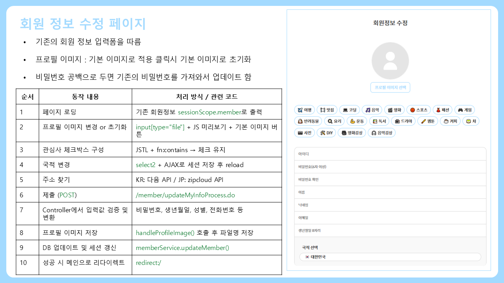

---

# :sparkles: 개요 / 概要
- **프로젝트명 / プロジェクト名**: Harunichi (한일 소셜미디어 플랫폼 / 日韓ソーシャルメディアプラットフォーム)
- **기간 / 期間**: 2025.05.26 ~ 2025.06.30
- **목표 / 目的**: 한국과 일본 사용자가 함께 커뮤니케이션하고 중고거래도 가능한 웹 기반 소셜미디어 플랫폼 개발  
  日本と韓国のユーザーが共にコミュニケーションし、中古取引も可能なWebベースのソーシャルメディアプラットフォームを開発

## :busts_in_silhouette: 팀원 / チームメンバー
- 강혜미 KANG HYEMI (<https://github.com/hyeming-way>)
- 이지원 LEE JIWON (<https://github.com/jeejeewon>)
- 윤지원 YOON JIWON (<https://github.com/YOON-J11>)
- 한현주 HAN HYUNJU (<https://github.com/Nyangmong>)

---

# :sunny: 개발 환경 / 開発環境

### View / フロントエンド  

### DB / データベース  

### Server / サーバー  

### 개발 도구 / 開発ツール  

### 개발 언어 / 開発言語  

### 사용 API / 使用API  
- [카카오 로그인 API / カカオログインAPI](https://developers.kakao.com/docs/latest/ko/kakaologin/common)  
- [포트원 결제 API / ポートワン決済API (KG이니시스, 엑심베イ)](https://developers.portone.io/api/rest-v1/pg)

---

# :hatched_chick: 구현한 기능들 / 実装機能

## 🏠 메인화면 / メイン画面  

## 👥 회원 기능 / 会員機能  
**로그인 / ログイン**  
  
**회원가입 / 会員登録**  
  
**회원정보 수정 및 탈퇴 / 会員情報の修正・退会**  

## 📝 게시판 / 掲示板  
**게시판 / 掲示板**  

## 💬 채팅 기능 / チャット機能  
**채팅 친구 추천 / チャット相手推薦**  
  
**개인 채팅 / 個人チャット**  
  
**오픈 채팅 / オープンチャット**  
  
**대화 내역 검색 / チャット履歴検索**  
  
**채팅방 정보 / チャットルーム情報**  
  
**채팅방 나가기 / チャットルームから退出**  
  
  
**방장 권한 / チャットリーダー権限**  

## 🛍 중고상품 기능 / 中古商品機能  
**메인 화면 / メイン画面**  
  
**상품 리스트 / 商品リスト**  
  
**상품 상세 / 商品詳細**  
  
**상품 등록,수정 / 商品登録,修正**  
 
**KG이니시스 결제 API / KGイニシス決済API**  
  
**엑심베이 결제 API / Eximbay決済API**  

**주문 내역 확인 / 注文履歴確認**  

## 🔌 API 연동 / API連携  
**카카오 로그인 / カカオログイン**  
  
**KG이니시스 결제 API / KGイニシス決済API**  
  
**엑심베이 결제 API / Eximbay決済API**  

---

# :shaved_ice: DB 구성 / DB構成  

---

## :carousel_horse: 마무리 소감 / 最後の感想  
**한현주 / ハン・ヒョンジュ**  
  
이번 프로젝트를 통해 상품 관리, 결제 시스템 등 다양한 웹 기술을 직접 구현하며 실무 감각을 익혔습니다.  
프론트엔드와 백엔드 전반을 경험하며 기술 스택을 자유롭게 넘나들었고, 사용자 경험을 고려한 기능 설계와 UI 개선에도 집중하였습니다.  
서비스 전체 흐름을 이해하고 주도적으로 구현한 경험은, 이후 개발 업무에 있어서도 큰 밑거름이 될 것이라 확신합니다.  
本プロジェクトでは、商品管理、決済システムなど様々なウェブ技術を自ら実現し、実務的な感覚を身につけることができました。  
フロントエンドとバックエンドの両方に携わり、技術スタックを自由に活用する中で、ユーザー体験を意識した機能設計やUI改善にも注力しました。  
サービス全体の流れを把握し、主体的に開発を進めた経験は、今後のエンジニア経歴において大きな財産になると確信しています。

---

## 🖥️ 실행 방법 / 実行方法（로컬 전용 / ローカルのみ）

- MySQL에서 DB 생성 후 SQL 스크립트 실행  
  MySQLにてデータベースを作成後、初期スクリプトを実行

- STS3(Spring Tool Suite 3)에서 Tomcat 9 설정 및 프로젝트 실행  
  STS3（Spring Tool Suite 3）にてTomcat9を設定し、プロジェクトを実行

- 웹 브라우저에서 아래 주소로 접속  
  以下のURLでWebブラウザからアクセス  
  ▶ **http://localhost:8090/harunichi**

---

## 🔎문의 / お問い合わせ  
**한현주 / HAN HYUNJU**  
📧 mira2539@gmail.com
